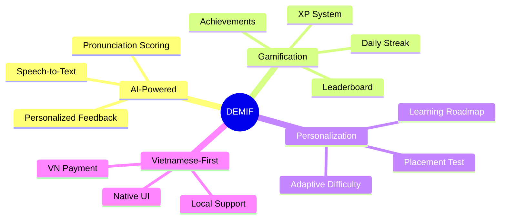
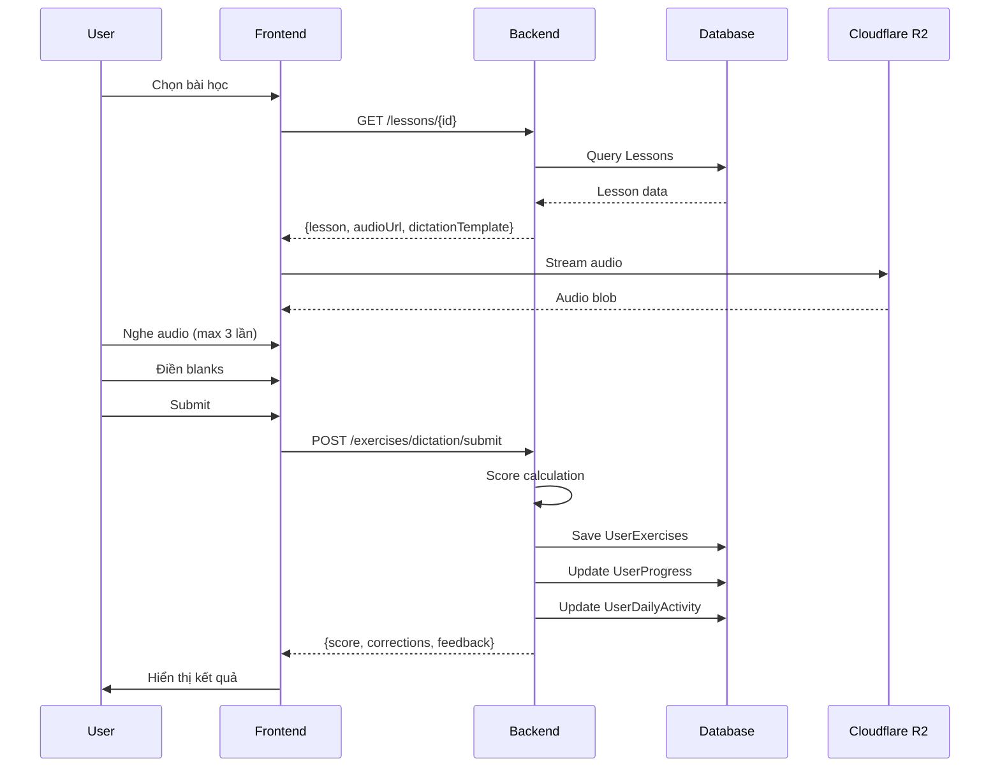
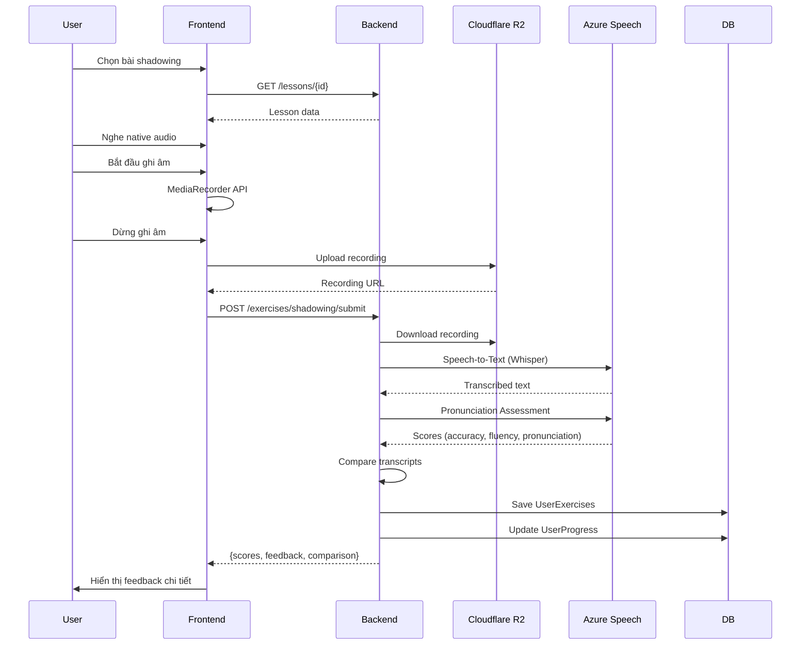
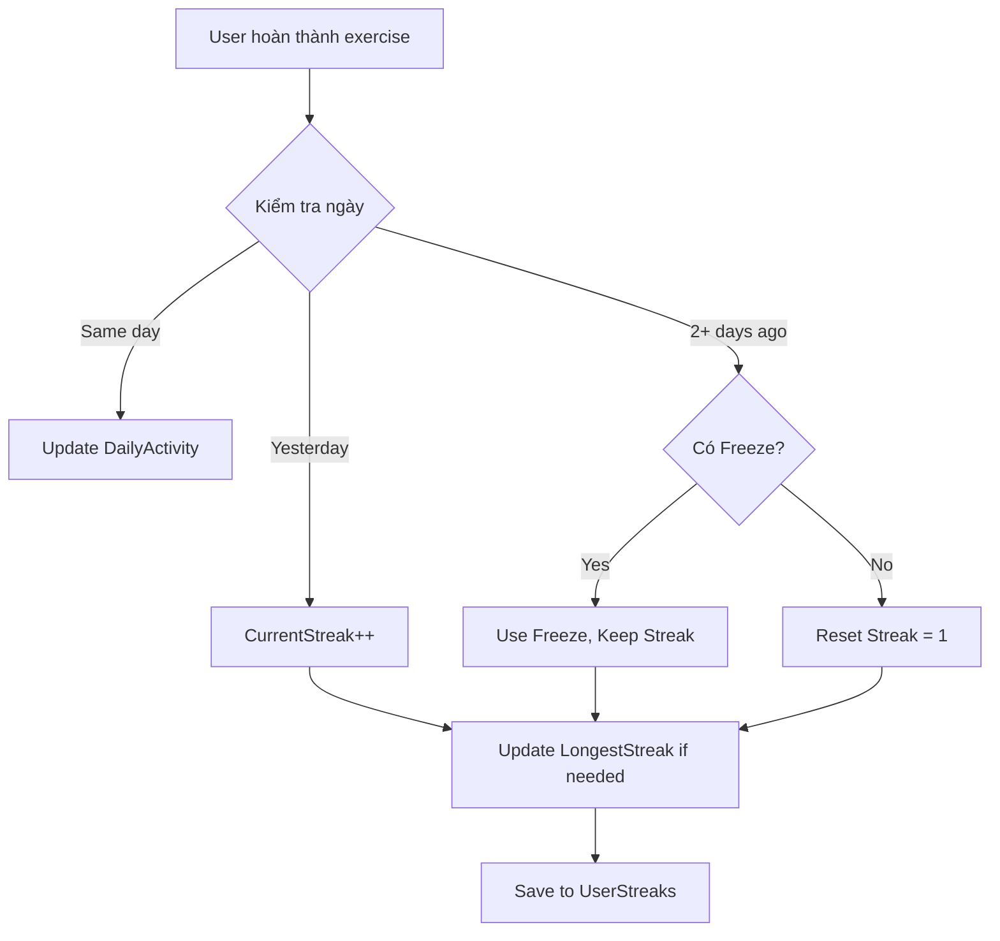
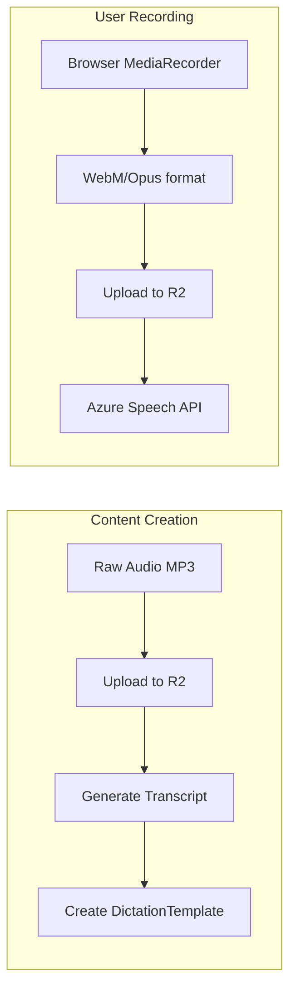
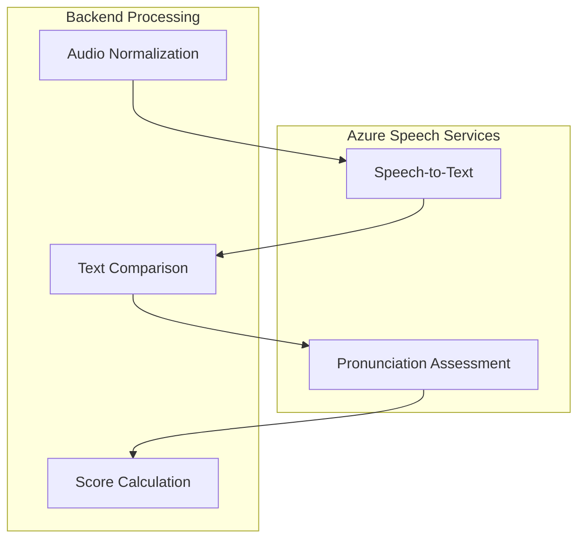
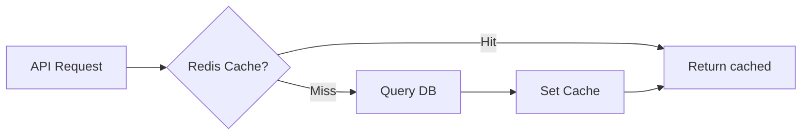
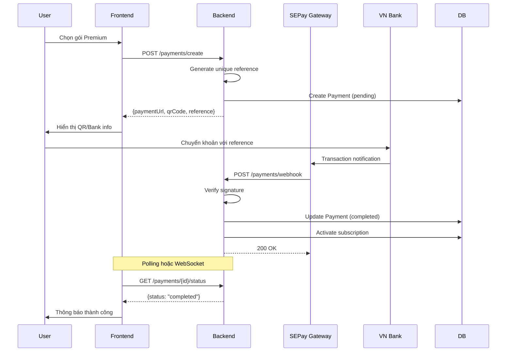
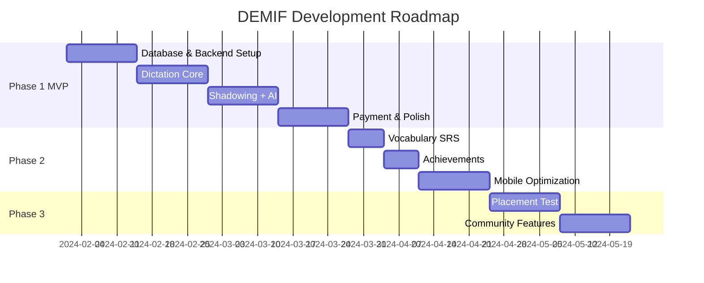

                                                                                                                                          # DEMIF - Business Analysis Document

## 1. Phân Tích Đối Thủ: DailyDictation.com

### 1.1 Tính Năng Hiện Có

| Feature | DailyDictation | Đánh Giá |
|---------|----------------|----------|
| Dictation exercises | ✅ Đầy đủ | Tốt, nhiều chủ đề |
| Multiple topics | ✅ 12+ categories | TOEIC, IELTS, News, TED |
| Video integration | ✅ YouTube | Nội dung phong phú |
| Mobile responsive | ✅ OK | Cơ bản |
| Free to use | ✅ 100% free | Ad-supported |

### 1.2 Điểm Yếu Cần Khai Thác

| Gap | Opportunity |
|-----|-------------|
| ❌ Không có Shadowing | DEMIF có luyện nói |
| ❌ Không AI feedback | DEMIF có pronunciation scoring |
| ❌ Không personalization | DEMIF có adaptive learning |
| ❌ Không gamification mạnh | DEMIF có streak, achievements |
| ❌ Không mobile app | DEMIF PWA first |
| ❌ UI tiếng Anh | DEMIF Vietnamese native |

---

## 2. DEMIF Core Differentiation

### 2.1 Unique Value Propositions



### 2.2 Feature Priority Matrix

| Feature | Impact | Effort | Priority |
|---------|--------|--------|----------|
| Dictation core | High | Medium | P0 |
| Shadowing + AI | High | High | P0 |
| Streak system | High | Low | P0 |
| Leaderboard | Medium | Low | P0 |
| Vocabulary SRS | Medium | Medium | P1 |
| Achievements | Medium | Medium | P2 |
| Placement test | High | High | P2 |
| Learning roadmap | High | High | P3 |

---

## 3. Chi Tiết Nghiệp Vụ

### 3.1 Dictation Flow



#### Dictation Template Structure

```json
{
  "lessonId": "uuid",
  "segments": [
    {"text": "Hello, my name is ", "isBlank": false},
    {"text": "___", "isBlank": true, "answer": "Sarah", "hint": "S____", "index": 0},
    {"text": ". Nice to ", "isBlank": false},
    {"text": "___", "isBlank": true, "answer": "meet", "hint": "m___", "index": 1},
    {"text": " you.", "isBlank": false}
  ],
  "totalBlanks": 2
}
```

#### Scoring Algorithm

```csharp
public class DictationScorer
{
    public DictationResult Calculate(List<string> userAnswers, List<BlankAnswer> correctAnswers, int playsUsed)
    {
        int correct = 0;
        var details = new List<BlankResult>();
        
        for (int i = 0; i < correctAnswers.Count; i++)
        {
            var userAns = userAnswers.ElementAtOrDefault(i)?.Trim().ToLower() ?? "";
            var correctAns = correctAnswers[i].Answer.ToLower();
            
            bool isCorrect = userAns == correctAns;
            if (isCorrect) correct++;
            
            details.Add(new BlankResult
            {
                Index = i,
                UserAnswer = userAnswers.ElementAtOrDefault(i),
                CorrectAnswer = correctAnswers[i].Answer,
                IsCorrect = isCorrect
            });
        }
        
        // Base score
        decimal baseScore = (decimal)correct / correctAnswers.Count * 100;
        
        // Penalty for extra plays
        int playPenalty = (playsUsed - 1) * 5; // -5 per extra play
        
        int finalScore = Math.Max(0, (int)baseScore - playPenalty);
        
        return new DictationResult
        {
            Score = finalScore,
            TotalBlanks = correctAnswers.Count,
            CorrectBlanks = correct,
            PlaysUsed = playsUsed,
            Details = details
        };
    }
}
```

### 3.2 Shadowing Flow



#### AI Scoring Components

| Component | Source | Description |
|-----------|--------|-------------|
| Word Accuracy | Local algorithm | Compare user vs original transcript |
| Pronunciation | Azure Speech | PronunciationAssessment API |
| Fluency | Azure Speech | Words per minute, pauses |
| Intonation | Azure Speech | Prosody analysis |

#### Shadowing Result Structure

```json
{
  "exerciseId": "uuid",
  "score": 81,
  "breakdown": {
    "wordAccuracy": 85,
    "pronunciation": 78,
    "fluency": 82,
    "intonation": 79
  },
  "comparison": {
    "originalText": "Hello, my name is Sarah.",
    "userText": "Hello, my name is Sara.",
    "differences": [
      {"word": "Sarah", "userSaid": "Sara", "type": "mispronunciation"}
    ]
  },
  "feedback": [
    {"type": "positive", "message": "Phát âm tốt từ 'Hello'"},
    {"type": "improvement", "message": "Cần cải thiện: Sarah → Sara"}
  ],
  "recordingUrl": "https://r2.demif.app/recordings/xxx.webm"
}
```

### 3.3 Streak Logic



#### Streak Rules

1. **Maintain streak**: Hoàn thành ít nhất 1 exercise/ngày
2. **Streak freeze**: Premium users có 2-5 freezes/tháng
3. **Reset rules**: Miss 2+ ngày = reset về 1
4. **Bonus points**: 7-day streak = +50 XP, 30-day = +200 XP

---

## 4. Technology Deep Dive

### 4.1 Audio Processing Pipeline



#### Audio Format Recommendations

| Use Case | Format | Why |
|----------|--------|-----|
| Lesson audio | MP3 | Wide compatibility |
| User recording | WebM/Opus | Smaller size, browser native |
| Storage | Original | No re-encoding |

### 4.2 AI Integration Architecture



#### Azure Speech Pricing (Free Tier)

| Service | Free Tier | Over Limit |
|---------|-----------|------------|
| Speech-to-Text | 5 hours/month | $1/hour |
| Pronunciation Assessment | 5 hours/month | $1/hour |

**Strategy**: Cache results, limit attempts per user/day

### 4.3 Caching Strategy với Redis



#### Cache Keys

| Key Pattern | TTL | Data |
|-------------|-----|------|
| `lesson:{id}` | 1 hour | Lesson details |
| `leaderboard:{period}` | 5 min | Top 100 |
| `progress:{userId}` | 10 min | User progress |
| `streak:{userId}` | 1 hour | Streak info |

### 4.4 SEPay Integration



#### SEPay Webhook Payload

```json
{
  "id": 123456,
  "gateway": "SEPAY",
  "transactionDate": "2024-01-15 10:30:00",
  "accountNumber": "123456789",
  "code": null,
  "content": "DEMIF-PAY-ABC123XYZ", // Our reference
  "transferType": "in",
  "transferAmount": 199000,
  "accumulated": 199000,
  "subAccount": null,
  "referenceCode": "SEP123456",
  "description": "Chuyen tien"
}
```

---

## 5. Điểm Khó và Giải Pháp

### 5.1 Technical Challenges

| Challenge | Solution |
|-----------|----------|
| Audio latency | CDN (Cloudflare), chunked streaming |
| AI cost | Rate limiting, caching, free tier optimization |
| Recording quality | Client-side audio normalization |
| Real-time scoring | Async processing, optimistic UI |

### 5.2 Business Challenges

| Challenge | Solution |
|-----------|----------|
| Content creation | Start with 50 lessons, community contribution |
| User retention | Gamification, streak, notifications |
| Conversion to paid | Freemium model, trial period |
| Competition | Focus on Vietnamese market, AI features |

---

## 6. Metrics & KPIs

### 6.1 North Star Metric
**Weekly Active Learners (WAL)** - Users completing ≥3 exercises/week

### 6.2 Supporting Metrics

| Category | Metric | Target |
|----------|--------|--------|
| Acquisition | Sign-ups/week | 200 |
| Activation | First lesson completion | 70% |
| Retention | Week 1 retention | 40% |
| Engagement | Exercises/user/week | 5 |
| Revenue | MRR | $500 (month 3) |
| NPS | Score | +40 |

---

## 7. Implementation Roadmap


